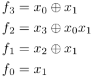

# Transformation Algorithms
We implement two transformation algorithms including Fibonacci-to-Type-II and 
Type-II-to-Fibonacci and run the code on a 4-bit Fibonacci 
NLFSR and the 256-bit Galois NLFSR in Espresso cipher respectively.

We also implement the comparison of Espresso, Espresso-a and Espresso-b, and the 
comparison of Espresso, Espresso-F and Espresso-F2.

# Scripts
Our algorithms are implemented in pure Python3, no any other
dependencies are required. There are four scripts in the directory
of 'algorithms_with_examples' and all these scripts can be executed independently.

Running them is pretty simple. For example, to run 'Uniform_FTG.py' script, just
open your terminal or IDE and type `python Uniform_FTG.py`. All the input
parameters are adjustable. More Details about these scripts are below.

#### 1. Uniform_FTG.py
The implementation of the Fibonacci-to-Type-II transformation algorithm.  

For example, we transform a 4-bit Fibonacci NLFSR into all the possible
uniform Galois NLFSRs.  
**Inputs:**  
Input parameters of the Fibonacci NLFSR.  
* The size of the Fibonacci NLFSR `n = 4`.
* The number of rounds to run the NLFSR `R = 1000`.
* The feedback functions of the Fibonacci NLFSR
`F = [[[1]], [[2]], [[3]], [[0], [1], [3], [1, 2]]]` denotes  
  
* The output function of the Fibonacci NLFSR `Z = [[2, 3]]` denotes  
  
* The randomly generated initial state of the Fibonacci NLFSR such as
`N0 = [0, 1, 1, 1]` denotes  
  
* The monomials to be shifted `M = [[1], [3], [1, 2]]` denotes monomials
x1, x3 and x1x2.

**Outputs:**  
Output all the possible equivalent Galois NLFSRs. For example, one of
the Galois NLFSR is represented by following parameters.  
* The end positions the monomials are shifted to `BFTG = [3, 1, 2]`
denote that x1 is not shifted, x3 is shifted to f1 and x1x2 is shifted to f2.  
* The compensation list `CFTG = [-1, -1, [[1]], [[2], [0, 1]]]` (-1 represents 0 in the description of the algorithm)  
* The feedback functions of the Galois NLFSR
`FFGal = [[[1]], [[2], [1]], [[3], [0, 1]], [[0], [1]]]` denotes  
  
* The output function of the Galois NLFSR `ZGal = [[1], [2], [0, 1], [1, 3], [2, 3], [0, 1, 2]]` denotes  
  
* The initial state of the Galois NLFSR `N0Gal = [0, 1, 0, 0]` denotes  

#### 2. Uniform_GTF.py
The implementation of the Type-II-to-Fibonacci transformation algorithm.  

The input Galois NLFSR must be an uniform NLFSR.  
For example, we run the code on the 256-bit Galois NLFSR
in Espresso cipher and successfully transform it into a LFSR with feedback
function below.  
  
The corresponding output function and the initial state of the LFSR
are output in the result. The length of the output function is the
number of monomials in the function.   

To be noted, all the uniform Galois NLFSRs transformed in this script
can be transformed by using Generalized_GTF.py as well.  
        
#### 3. Espresso_a_b.py
Compare the output sequence of the Espresso, Espresso-a and Espresso-b.   

The feedback functions `FFGal_a`and output function `ZGal_a` of the Espresso-a
are from reference [16] in the paper.
The parameters of Espresso-b are obtained from running Uniform_GTF.py and Uniform_FTG.py on
Espresso, which shows that the output function `FFGal_b` of Espresso-b has 104
variables and 1988 monomials. In the script, the parameter of the output
function `ZGal_b` reads from file ZGal_b.txt. 

The result shows that Espresso cipher is equivalent to Espresso-b not Espresso-a. 

#### 4. Espresso_F_F2.py
Compare the output sequence of the Espresso, Espresso-F and Espresso-F2.   

The feedback functions `FFGal_F`and output function `ZGal_F` of the Espresso-F
are from reference [2] in the paper.
The parameters of Espresso-F2 are obtained from running Uniform_FTG.py on
Espresso, which shows that the output function `FFGal_F2` of Espresso-F2 has 104
variables and 7942 monomials. In the script, the parameter of the output
function `ZGal_F2` reads from file ZGal_F2.txt. 

The result shows that Espresso cipher is equivalent to Espresso-F2 not Espresso-F. 
